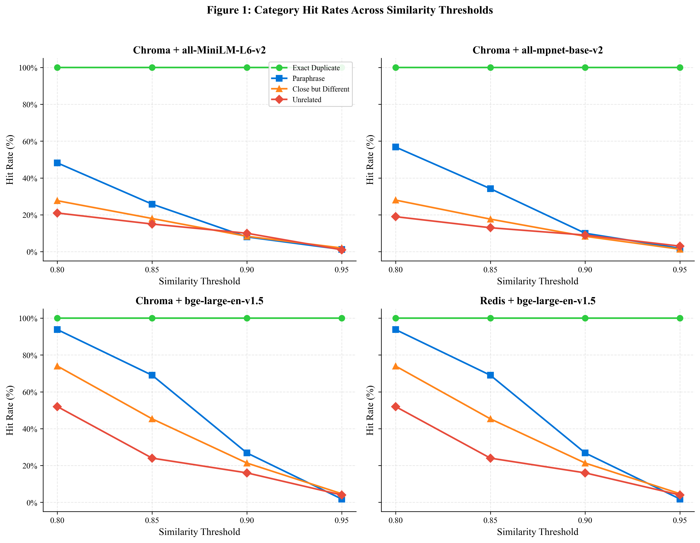
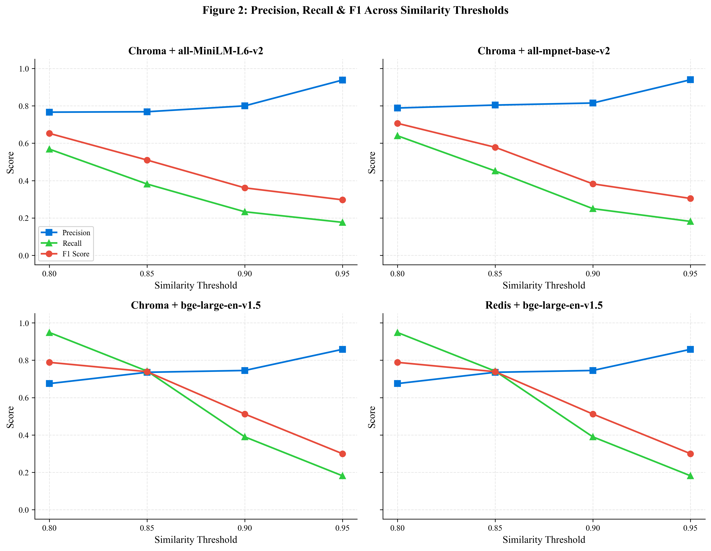
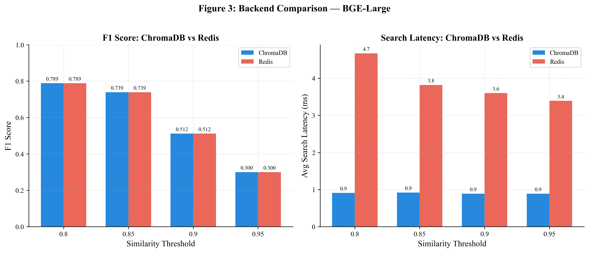
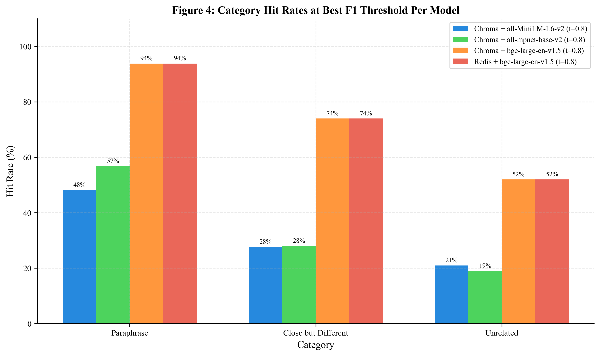

# Hit-or-Miss — Benchmark Report
Generated: 2026-03-31T16:46:39.058914+00:00
Quick mode: No

## Executive Summary

- **Best combo:** Chroma + BAAI/bge-large-en-v1.5 @ threshold 0.8
  - F1: 0.7886 | Precision: 0.6750 | Recall: 0.9483
  - Hit rate: 84.3% | False positive rate: 68.5%

- **Estimated cost savings** (assuming best combo hit rate):
  - 1,000 requests/month: ~$6.83 saved (843 cache hits)
  - 10,000 requests/month: ~$68.28 saved (8,430 cache hits)
  - 100,000 requests/month: ~$682.83 saved (84,300 cache hits)

- **Model size finding:** Large model (BGE) outperforms small model (MiniLM) by 0.1360 F1
  - Embedding latency: large is 2.5x slower than small

- **Backend comparison (BGE-Large):** ChromaDB vs Redis
  - Accuracy is identical (same embeddings, same similarity math)
  - Search latency: Redis 4.7ms vs ChromaDB 0.9ms (0.2x slower)

## Charts

### Category Hit Rates Across Thresholds
**Key Takeaway: BGE-Large maintains high paraphrase detection (~94%) even at threshold 0.85, while MiniLM and MPNet
drop sharply — the larger model gives you a much wider "usable threshold range" before paraphrase recall
collapses**

### Precision, Recall & F1 Across Thresholds
**Key Takeaway: For all models, recall drops far faster than precision as threshold increases, meaning raising the
threshold mostly costs you cache hits (savings) rather than gaining you accuracy — the diminishing returns
kick in hard after 0.85**

### Backend Comparison — ChromaDB vs Redis (BGE-Large)

**Key Takeaway: The vector store choice has zero impact on accuracy (identical F1 bars), but ChromaDB is 4-5x faster
on search at this scale due to in-process execution vs Redis's TCP overhead**

### Category Hit Rates at Best F1 Threshold Per Model
**Key Takeaway: BGE-Large's paraphrase advantage (94% vs 48-57%) comes at a steep cost: its false positive rate on
close-but-different prompts (74%) is nearly 3x worse than the smaller models (28%), showing that the bigger
model is more aggressive across the board, not just on correct matches**

## Full Comparison Table

| Backend | Model | Threshold | Hit Rate | Precision | Recall | F1 | FP Rate | Avg Embed (ms) | Avg Search (ms) |
|---------|-------|-----------|----------|-----------|--------|----|---------|----------------|-----------------|
| **chroma** | **BAAI/bge-large-en-v1.5** | **0.8** | **84.3%** | **0.6750** | **0.9483** | **0.7886** | **68.5%** | **21.7** | **0.9** |
| **redis** | **BAAI/bge-large-en-v1.5** | **0.8** | **84.3%** | **0.6750** | **0.9483** | **0.7886** | **68.5%** | **24.9** | **4.7** |
| **chroma** | **BAAI/bge-large-en-v1.5** | **0.85** | **60.5%** | **0.7355** | **0.7417** | **0.7386** | **40.0%** | **21.0** | **0.9** |
| **redis** | **BAAI/bge-large-en-v1.5** | **0.85** | **60.5%** | **0.7355** | **0.7417** | **0.7386** | **40.0%** | **22.0** | **3.8** |
| **chroma** | **BAAI/bge-large-en-v1.5** | **0.9** | **31.4%** | **0.7452** | **0.3900** | **0.5120** | **20.0%** | **20.8** | **0.9** |
| **redis** | **BAAI/bge-large-en-v1.5** | **0.9** | **31.4%** | **0.7452** | **0.3900** | **0.5120** | **20.0%** | **23.0** | **3.6** |
| **chroma** | **BAAI/bge-large-en-v1.5** | **0.95** | **12.7%** | **0.8583** | **0.1817** | **0.2999** | **4.5%** | **21.1** | **0.9** |
| **redis** | **BAAI/bge-large-en-v1.5** | **0.95** | **12.7%** | **0.8583** | **0.1817** | **0.2999** | **4.5%** | **22.9** | **3.4** |
| chroma | all-MiniLM-L6-v2 | 0.8 | 44.5% | 0.7663 | 0.5683 | 0.6526 | 26.0% | 8.6 | 0.8 |
| chroma | all-MiniLM-L6-v2 | 0.85 | 29.8% | 0.7685 | 0.3817 | 0.5100 | 17.2% | 8.4 | 0.8 |
| chroma | all-MiniLM-L6-v2 | 0.9 | 17.5% | 0.8000 | 0.2333 | 0.3613 | 8.8% | 8.4 | 0.8 |
| chroma | all-MiniLM-L6-v2 | 0.95 | 11.3% | 0.9381 | 0.1767 | 0.2973 | 1.8% | 8.4 | 0.8 |
| chroma | all-mpnet-base-v2 | 0.8 | 48.7% | 0.7885 | 0.6400 | 0.7065 | 25.8% | 21.6 | 1.1 |
| chroma | all-mpnet-base-v2 | 0.85 | 33.7% | 0.8042 | 0.4517 | 0.5784 | 16.5% | 17.2 | 0.9 |
| chroma | all-mpnet-base-v2 | 0.9 | 18.4% | 0.8152 | 0.2500 | 0.3827 | 8.5% | 16.9 | 1.0 |
| chroma | all-mpnet-base-v2 | 0.95 | 11.6% | 0.9397 | 0.1817 | 0.3045 | 1.8% | 17.0 | 1.0 |

## Results by Category

Per combo at its best threshold (by F1):

### Chroma + BAAI/bge-large-en-v1.5 (threshold=0.8)

| Category | Total | Hits | Hit Rate | Accuracy | Expected |
|----------|-------|------|----------|----------|----------|
| exact_duplicate | 100 | 100 | 100.0% | 100.0% | Should be 100% |
| paraphrase | 500 | 469 | 93.8% | 93.8% | Higher is better |
| close_but_different | 300 | 222 | 74.0% | 26.0% | Lower is better |
| unrelated | 100 | 52 | 52.0% | 48.0% | Should be 0% |

### Chroma + all-MiniLM-L6-v2 (threshold=0.8)

| Category | Total | Hits | Hit Rate | Accuracy | Expected |
|----------|-------|------|----------|----------|----------|
| exact_duplicate | 100 | 100 | 100.0% | 100.0% | Should be 100% |
| paraphrase | 500 | 241 | 48.2% | 48.2% | Higher is better |
| close_but_different | 300 | 83 | 27.7% | 72.3% | Lower is better |
| unrelated | 100 | 21 | 21.0% | 79.0% | Should be 0% |

### Chroma + all-mpnet-base-v2 (threshold=0.8)

| Category | Total | Hits | Hit Rate | Accuracy | Expected |
|----------|-------|------|----------|----------|----------|
| exact_duplicate | 100 | 100 | 100.0% | 100.0% | Should be 100% |
| paraphrase | 500 | 284 | 56.8% | 56.8% | Higher is better |
| close_but_different | 300 | 84 | 28.0% | 72.0% | Lower is better |
| unrelated | 100 | 19 | 19.0% | 81.0% | Should be 0% |

### Redis + BAAI/bge-large-en-v1.5 (threshold=0.8)

| Category | Total | Hits | Hit Rate | Accuracy | Expected |
|----------|-------|------|----------|----------|----------|
| exact_duplicate | 100 | 100 | 100.0% | 100.0% | Should be 100% |
| paraphrase | 500 | 469 | 93.8% | 93.8% | Higher is better |
| close_but_different | 300 | 222 | 74.0% | 26.0% | Lower is better |
| unrelated | 100 | 52 | 52.0% | 48.0% | Should be 0% |

## Latency Analysis

| Backend | Model | Avg Embed (ms) | Avg Search (ms) | Total Cache Lookup (ms) | vs LLM Call (~1-3s) |
|---------|-------|----------------|-----------------|------------------------|---------------------|
| chroma | BAAI/bge-large-en-v1.5 | 21.1 | 0.9 | 22.1 | 68x faster |
| chroma | all-MiniLM-L6-v2 | 8.5 | 0.8 | 9.3 | 162x faster |
| chroma | all-mpnet-base-v2 | 18.2 | 1.0 | 19.2 | 78x faster |
| redis | BAAI/bge-large-en-v1.5 | 23.2 | 3.9 | 27.1 | 55x faster |

## Cost Savings Projection

Assumptions:
- Claude API pricing: $3.0/MTok input, $15.0/MTok output (Sonnet)
- Average prompt: 200 tokens, average response: 500 tokens
- Cost per API call: $0.008100

| Requests/Month | Hit Rate | Cached Calls | Monthly Savings |
|---------------|----------|--------------|-----------------|
| 1,000 | Low (40%) | 400 | $3.24 |
| 1,000 | Med (60%) | 600 | $4.86 |
| 1,000 | High (80%) | 800 | $6.48 |
| 10,000 | Low (40%) | 4,000 | $32.40 |
| 10,000 | Med (60%) | 6,000 | $48.60 |
| 10,000 | High (80%) | 8,000 | $64.80 |
| 100,000 | Low (40%) | 40,000 | $324.00 |
| 100,000 | Med (60%) | 60,000 | $486.00 |
| 100,000 | High (80%) | 80,000 | $648.00 |

## Raw Data

Full results: [`reports/benchmark_results.json`](benchmark_results.json)
- 100 prompt groups tested
- 16000 total queries executed
- Backends: chroma, redis
- Models: BAAI/bge-large-en-v1.5, all-MiniLM-L6-v2, all-mpnet-base-v2
- Thresholds: 0.8, 0.85, 0.9, 0.95
